# Implementation Plan V4: Multi-Playlist Profiles, Exhaustive Extraction, and Deep Links

> **Status: IMPLEMENTED** (June 2026). Supersedes V3.
> Last updated: entity extraction, targeted research, grouped Links + Resources, playlist manager.

---

## Goal

1. **Multi-playlist profiles** — each playlist has its own KB; dashboard-managed
2. **Exhaustive extraction** — guest profiles, major + minor insights, depth on agenda/KB matches
3. **Deep links & targeted research** — no vague insights; every important mention gets specifics + URLs where possible

---

## The problem today (why insights feel incomplete)

Current pipeline research in [`researcher.py`](researcher.py) only searches:
- The **guest name** (if recon finds one)
- **Top 3 generic topics** from recon (e.g. "space tech", "careers")

It does **not**:
- Search for **specific people, companies, or stories** mentioned in the video
- Pull URLs from Tavily into a user-facing **Links** section
- Fetch the **YouTube video description** (where speakers often put resource lists)
- Forbid vague insights like *"speaker provides a list of 50 companies"* without listing them

**Tavily's job is to search — our job is to tell it what to search.** That requires a new **entity extraction pass** before research runs.

---

## User decisions (locked in)

| Decision | Choice |
|----------|--------|
| Playlist management | Dashboard — add/edit playlists in UI |
| Output structure | Profile-driven from transcript — flexible clusters |
| Resources | Always extracted — books, papers, tools, URLs, companies, people |
| Coverage | Exhaustive — major + minor; depth on agenda/KB matches |
| Guest profiles | Per episode only |
| Timestamps | Internal only — help model anchor facts; not shown in UI |
| Unnamed entities | Web-search to identify (e.g. "Pakistani woman SpaceX") — mark **confirmed** vs **likely** |
| Links UI | **Grouped links** (video / description / research) **+ separate Resources list** for items without URLs |

---

## Pipeline flow (V4)

```mermaid
flowchart TD
    subgraph ingest [Ingest]
        Captions[Transcript with internal timestamps]
        Description[YouTube video description]
    end

    subgraph pass1 [Pass 1 — Structure]
        Recon[Recon: guest, topics, format]
    end

    subgraph pass2 [Pass 2 — What to research]
        Entities[Entity extraction: people, companies, lists, stories, URLs]
        Agenda[Auto-agenda from global + playlist profile]
    end

    subgraph pass3 [Pass 3 — Research via Tavily]
        GuestSearch[Guest research]
        TopicSearch[Topic research]
        TargetedSearch[Targeted searches per entity]
        DescLinks[Parse links from description]
    end

    subgraph pass4 [Pass 4 — Extract]
        Holistic[Gemini holistic extraction with all context]
    end

    subgraph output [Output]
        Insights[Insights — no vague references]
        LinksGrouped[Links: From video / From description / From research]
        Resources[Resources without URLs — books, companies, tools as text]
    end

    Captions --> Recon
    Description --> DescLinks
    Recon --> Entities
    Recon --> Agenda
    Entities --> TargetedSearch
    Recon --> GuestSearch
    Recon --> TopicSearch
    GuestSearch --> Holistic
    TopicSearch --> Holistic
    TargetedSearch --> Holistic
    DescLinks --> Holistic
    Agenda --> Holistic
    Captions --> Holistic
    Holistic --> Insights
    Holistic --> LinksGrouped
    Holistic --> Resources
    TargetedSearch --> LinksGrouped
    DescLinks --> LinksGrouped
```



---

## Change A: Multi-playlist profiles

(Unchanged from prior V4 — see below.)

### Playlists table (`db.py`)

```sql
playlists (
  playlist_id TEXT PRIMARY KEY,
  name TEXT NOT NULL,
  description TEXT DEFAULT '',
  profile_json TEXT NOT NULL,
  extraction_focus TEXT DEFAULT '',
  enabled INTEGER DEFAULT 1,
  created_at TEXT
)
```

- Videos get `playlist_id` column
- **Global profile** (sidebar) + **Playlist profile** merged into prompts
- Migrate `.env` PLAYLIST_ID / PODCASTS_PLAYLIST_ID into DB on init

---

## Change B: Entity extraction pass (NEW — feeds Tavily)

**File:** [`pipeline.py`](pipeline.py) — new `_extract_research_targets()`

After recon, before Tavily runs, Gemini extracts **everything worth searching**:

```json
{
  "research_targets": [
    {
      "query": "Pakistani woman SpaceX computer science stock options 100 million",
      "type": "person_story",
      "transcript_context": "Speaker said she took pay cut in early 2010s, CS role, $60M then $100M",
      "confidence": "needs_research"
    },
    {
      "query": "space tech startups list aerospace companies hiring",
      "type": "company_list",
      "transcript_context": "Speaker mentioned list of 50+ space tech startups",
      "confidence": "partial_in_transcript"
    },
    {
      "name": "Relativity Space",
      "type": "company",
      "transcript_context": "mentioned as example",
      "confidence": "confirmed"
    }
  ],
  "urls_in_transcript": ["https://..."],
  "lists_to_expand": [
    {
      "label": "Space tech startups mentioned",
      "items_found_in_transcript": ["Company A", "Company B", "..."],
      "speaker_claimed_count": 50
    }
  ]
}
```

**Rules:**
- If speaker claims "50 companies" but transcript only names 12 → store all 12 + flag `speaker_claimed_count: 50` + Tavily search for broader list
- Named URLs in transcript → copy to links immediately
- Unnamed people/stories → become Tavily queries

---

## Change C: Targeted research (upgrade `researcher.py`)

**Yes, this is Tavily's job — but triggered by entity extraction, not just guest + 3 topics.**

New function: `research_targets(targets: list[dict]) -> dict`

For each target (up to ~8–10 per video to stay within free tier):
1. Build a specific Tavily query from `query` or `name` + context
2. Return **structured results with URLs preserved**:

```json
{
  "target": "Pakistani woman SpaceX stock options",
  "status": "likely_match",
  "matches": [
    {
      "title": "...",
      "url": "https://...",
      "snippet": "...",
      "confidence": "likely"
    }
  ]
}
```

**Confidence labels:**
- `confirmed` — name/details explicitly in transcript; research adds links/context
- `likely` — identified via web search from partial description; show with "Likely match" badge
- `not_found` — searched but no good match; insight still shows transcript details only

Keep existing guest + topic research; **add** targeted searches on top.

---

## Change D: YouTube description links (NEW)

**File:** new helper in [`youtube_monitor.py`](youtube_monitor.py) OR small `video_metadata.py`

Fetch video description via YouTube Data API (already have `YOUTUBE_API_KEY`) or yt-dlp metadata:
- Parse all URLs
- Parse common patterns: "Resources:", "Links:", "Companies mentioned:", bullet lists
- Feed into Links section as **From description**

If description says "full list in description" and list is there → extract it.

---

## Change E: Anti-vague extraction rules

**File:** [`pipeline.py`](pipeline.py) — `_holistic_extraction()` prompt additions

Hard rules for Gemini:
- **NEVER** write "speaker mentioned a list of X" without listing items found in transcript
- If list is partial → show partial list + note "speaker referenced N total; M captured from transcript; see Links for more"
- **NEVER** write "a woman at SpaceX" without name if transcript OR research identified her
- For each insight about a person/company/tool → include name, and link if research found one
- Pull all resources from transcript + description + research into structured output

---

## Change F: Structured output schema (expanded)

Store in `structured_insights` column + denormalize links for UI:

```json
{
  "summary": "...",
  "guest_profile": { "name", "background", "current_work", "notable_achievements" },
  "resources": [
    {
      "name": "Relativity Space",
      "type": "company",
      "detail": "mentioned as hiring for propulsion roles",
      "url": null,
      "source": "transcript"
    }
  ],
  "links": {
    "from_video": [
      { "title": "SpaceX careers", "url": "https://...", "context": "speaker recommended checking listings" }
    ],
    "from_description": [
      { "title": "50 Space Startups List", "url": "https://...", "context": "linked in video description" }
    ],
    "from_research": [
      { "title": "...", "url": "https://...", "context": "...", "confidence": "likely" }
    ]
  },
  "insights": [
    { "topic", "priority", "is_agenda_item", "is_kb_match", "points", "related_links": ["url1"] }
  ]
}
```

**Flat `links_all`** also stored for simple UI rendering (deduplicated by URL).

---

## Change G: Dashboard — Links & Resources panels

**File:** [`app.py`](app.py)

New section on DONE videos (above or below insights):

### Links (grouped, all clickable)

| Group | Content |
|-------|---------|
| **From video** | URLs/names explicitly mentioned in transcript |
| **From description** | URLs parsed from YouTube description |
| **From web research** | Tavily results; "Likely match" badge where applicable |

### Resources (no URL needed)

Text list of books, companies, tools, frameworks, people — everything mentioned even if no link found. Example:

- Relativity Space (company — transcript)
- "Introduction to Rocket Propulsion" (book — speaker recommendation)
- 50 space startups (partial list: A, B, C… — see Links for more)

---

## Example: fixing the user's two cases

| Insight today (bad) | V4 behavior |
|---------------------|-------------|
| "Speaker provides list of 50+ companies" | Lists all companies named in transcript + description; Tavily search for "space tech startups list"; Links section has articles/lists with URLs |
| "Pakistani woman took pay cut at SpaceX… $100M" | Entity pass queries Tavily; if match found → name + article link with "Likely match"; insight names her; Links has source URL |

---

## Files to change (when building)

| File | Change |
|------|--------|
| [`db.py`](db.py) | Playlists table, `structured_insights`, `links_json` column optional |
| [`pipeline.py`](pipeline.py) | Entity extraction pass, anti-vague rules, description fetch hook, merge links |
| [`researcher.py`](researcher.py) | `research_targets()`, preserve URLs, confidence labels |
| NEW `video_metadata.py` or extend [`youtube_monitor.py`](youtube_monitor.py) | Fetch + parse video description URLs |
| [`poll.py`](poll.py) | Poll from DB playlists |
| [`app.py`](app.py) | Playlist manager, **Links** (grouped) + **Resources** panels |
| [`PLAN.md`](PLAN.md) | Document V4 |

**Do not modify:** [`transcriber.py`](transcriber.py)

---

## Tavily budget estimate

Per podcast video:
- Guest: ~4 searches
- Topics (3): ~6 searches
- Entity targets (~6): ~12 searches
- **Total: ~22 searches/video**

Free tier = 1000/month → ~45 videos/month. Configurable cap via `MAX_RESEARCH_TARGETS=6` in env.

---

## Verification checklist

1. Video mentions "50 companies" → insight lists companies found + Links has research URLs
2. Video tells unnamed person story → research identifies likely person + link with confidence badge
3. Description has resource links → appear under "From description"
4. Resources panel lists books/tools even without URLs
5. No insight says "speaker mentioned X" without specifics when transcript or research has them
6. Multi-playlist KB still shapes depth on matched topics

---

## Change H: Dual insight copies (auto + manual)

When a user generates **custom agenda** insights, the **auto-generated (General) copy is never overwritten**.

| Column | Purpose |
|--------|---------|
| `summary`, `key_points`, `auto_agenda`, `research_data` | **General** — auto profile-driven insights (preserved) |
| `manual_summary`, `manual_key_points`, `user_agenda` | **Custom** — manual agenda insights (replaced on each regen) |

**Flow:**
1. Video added → auto-process → saves General copy
2. User writes custom agenda → **Generate custom insights** → saves Manual copy only
3. User regens custom agenda → overwrites Manual copy only; General tab unchanged

**UI:** Two tabs on DONE podcast videos — **General insights** | **Custom agenda insights**

**API:** `process_one(video_id, manual_regenerate=True|False)`

---

## Build order (recommended)

0. ~~Dual insight copies (auto + manual)~~ **DONE**
1. ~~Entity extraction pass + anti-vague extraction rules~~ **DONE**
2. ~~Targeted Tavily research + URL preservation~~ **DONE**
3. ~~YouTube description link fetch~~ **DONE**
4. ~~Links & Resources UI panels~~ **DONE**
5. ~~Multi-playlist profiles (dashboard manager)~~ **DONE**
